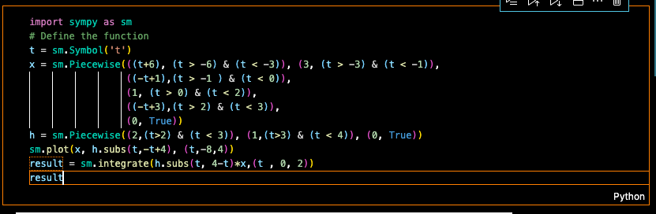

# 📊 Signal Processing Systems 2

A comprehensive collection of signal processing implementations including Fourier Transforms, Laplace Transforms, and system analysis.


## 🎯 Features

- Fourier Transform Analysis
- Laplace Transform Implementations
- System Response Calculations
- Signal Visualization Tools
- Linear Time-Invariant Systems

## 🔧 Installation

```bash
# Clone the repository
git clone https://github.com/Ivyson/Signals-Pamphile.git

# Install required packages
pip install -r [requirements.txt]((http://_vscodecontentref_/1))
```

## 📚 Project Structure

```plaintext
signal-processing/
├── Fourier/
│   ├── FourierTransform.ipynb
│   └── 
├── Laplace/
│   ├── LaplaceTransform.ipynb
│   └── SystemResponse.py
└── Systems/
    ├── LTI_Systems.ipynb
    └── ConvolutionAnalysis.py
```

## 🚀 Notes to Self

- Do not use Heaviside to create Switch function your input functions,instead use Piecewise, because it is much easier to integrate Piecewise functions compared to Heaviside.
- Sketch the graph for every question to ensure the correspondence of Data.
- For discrete convolution, remember the formula : convolution lenght = len(x) + len(h) - 1
      - The first element returned in the convolution array is having an index of: lowerboundindex(x) + lowerboundindex(h).
- For convolution in the Continious Time Domain.
      - Sketch both graphs indivisually for checking the correspondence of the data.
      - Do not use `sm.Heaviside` for defining unit step function, just use `sm.Piecewise`
      - Sketch both graphs on the same set of Axis to visualise the over-lap, shift the graph as stated in the question, and then integrate using the following approach.


## 📐 Transfer Functions

### Laplace Domain (s-domain)

#### RLC Circuit (Voltage across Capacitor)

```math
H(s) = \frac{V_{out}(s)}{V_{in}(s)} = \frac{1/sC}{R + sL + 1/sC} = \frac{1}{s^2LC + sRC + 1}
```

#### RL Circuit (Voltage across Inductor)

```math
H(s) = \frac{V_{out}(s)}{V_{in}(s)} = \frac{sL}{R + sL} = \frac{sL/R}{s + R/L}
```

#### LC Circuit (Voltage across Capacitor)

```math
H(s) = \frac{V_{out}(s)}{V_{in}(s)} = \frac{1/sC}{sL + 1/sC} = \frac{1}{s^2LC + 1}
```

#### RC Circuit (Voltage across Capacitor)

```math
H(s) = \frac{V_{out}(s)}{V_{in}(s)} = \frac{1/sC}{R + 1/sC} = \frac{1}{sRC + 1}
```

### Magnitude and Phase

For frequency domain analysis with input voltage $V_{in}$ and frequency $f$ where $ω = 2πf$:

#### RC Low Pass

- Magnitude: $|H(jω)| = \frac{1}{\sqrt{1 + (ωRC)^2}}$
- Phase: $\phi(ω) = -\tan^{-1}(ωRC)$
- Corner Frequency: $f_c = \frac{1}{2πRC}$

#### RL High Pass Filter

- Magnitude: $|H(jω)| = \frac{ωL}{\sqrt{R^2 + (ωL)^2}}$
- Phase: $\phi(ω) = \tan^{-1}(\frac{R}{ωL})$
- Corner Frequency: $f_c = \frac{R}{2πL}$