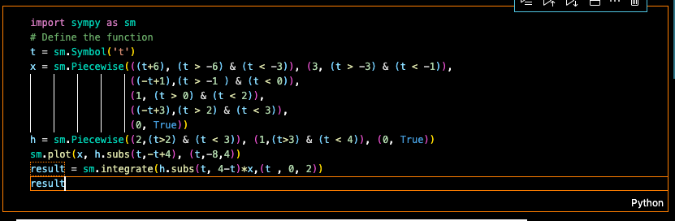

# Signal Processing Systems 2
A comprehensive collection of signal processing implementations including Fourier Transforms, Laplace Transforms, and system analysis.


## Features

- Fourier Transform Analysis
- Laplace Transform Implementations
- System Response Calculations
- Signal Visualization Tools
- Linear Time-Invariant Systems

## Installation

```bash
# Clone the repository
git clone https://github.com/Ivyson/Signals-Pamphile.git
```

Check out the `pyproject` File for the libraries needed for this module, use `uv` to install the required packages instead of `pip`

## Project Structure

```sh
.
├── Examples
│   ├── ConvCT.png
│   ├── Cosine.png
│   ├── DFT.py
│   ├── FourierMagnitude.py
│   ├── Laplace-Transform.py
│   ├── RC.py
│   ├── README.md
│   └── Z-Transform.py
├── FISA
│   ├── ConvolutionCT.ipynb
│   ├── ConvolutionCT.png
│   ├── Laplace_Transform.ipynb
│   ├── LTI.ipynb
│   ├── Q1.ipynb
│   ├── Q1.png
│   ├── Question5.ipynb
│   ├── RectangularWave.ipynb
│   ├── RectangularWave.png
│   ├── RL.ipynb
│   ├── RL.png
│   ├── Shekhinah2.ipynb
│   ├── Shekhinah.ipynb
│   ├── Switchedcosine copy.ipynb
│   ├── Switchedcosine.ipynb
│   ├── Switchedcosine.png
│   ├── Transfer.png
│   └── TrasnferFunction.ipynb
├── pyproject.toml
├── README.md
├── Test 1 A
│   ├── Q1.ipynb
│   ├── Q1.png
│   ├── Q2.ipynb
│   ├── Q2.png
│   ├── Q3.ipynb
│   ├── Q3.png
│   ├── Q4.ipynb
│   ├── Q4.png
│   ├── Q5.ipynb
│   ├── Q5.png
│   ├── Q6.ipynb
│   ├── Q6.png
│   ├── Q6.py
│   ├── Q7.ipynb
│   ├── Q7.png
│   ├── Q9.ipynb
│   └── Q9.png
├── Test 1 B
│   ├── Q2.ipynb
│   ├── Q2.png
│   ├── Q3.ipynb
│   ├── Q3.png
│   ├── Q4.ipynb
│   ├── Q4.png
│   ├── Q5.ipynb
│   ├── Q5.png
│   ├── Q6.ipynb
│   ├── Q6.png
│   ├── Q8.1.png
│   ├── Q8.2.png
│   ├── Q8Conv.png
│   └── Q8.ipynb
├── Test 1 C
│   ├── Q1.ipynb
│   ├── Q1.png
│   ├── Q2.ipynb
│   ├── Q2.png
│   ├── Q3.ipynb
│   ├── Q3.png
│   ├── Q4.ipynb
│   ├── Q4.png
│   ├── Q5A.png
│   ├── Q5B.png
│   ├── Q5.ipynb
│   ├── Q6.ipynb
│   ├── Q6.png
│   ├── Q7.ipynb
│   ├── Q7.png
│   ├── Q8.ipynb
│   ├── Q8.png
│   ├── Q9.ipynb
│   └── Q9.png
├── Test 2 A
│   ├── Q1.ipynb
│   ├── Q1.png
│   ├── Q2.ipynb
│   ├── Q2.png
│   ├── Q3.ipynb
│   ├── Q3.png
│   ├── Q4.ipynb
│   ├── Q4.png
│   ├── Q5.ipynb
│   └── Q5.png
├── Test 2 B
│   ├── image.png
│   ├── Q1.ipynb
│   ├── Q2.ipynb
│   ├── Q3.ipynb
│   ├── Q3.png
│   ├── Q3.py
│   ├── Q4.ipynb
│   ├── Q4.png
│   ├── Q5.ipynb
│   ├── Q5.png
│   └── Q5.py
├── Test 2 C
│   ├── Q1.ipynb
│   ├── Q1.png
│   ├── Q2.ipynb
│   └── Q2.png
└── uv.lock

9 directories, 104 files
```

## Notes to Self

- Do not use Heaviside to create Switch function your input functions,instead use Piecewise, because it is much easier to integrate Piecewise functions compared to Heaviside(as far as `sympy` is concerned).
- Sketch the graph for every question to ensure the correspondence of Data.
- For discrete convolution, remember the formula : convolution lenght = len(x) + len(h) - 1
      a. The first element returned in the convolution array is having an index of: lowerboundindex(x) + lowerboundindex(h).
- For convolution in the Continious Time Domain.
      1. Sketch both graphs indivisually for checking the correspondence of the data.
      2. Do not use `sm.Heaviside` for defining unit step function, just use `sm.Piecewise`
      3. Sketch both graphs on the same set of Axis to visualise the over-lap, shift the graph as stated in the question, and then integrate using the following approach.


## Transfer Functions

### Laplace Domain (s-domain)

#### RLC Circuit (Voltage across Capacitor)

```math
H(s) = \frac{V_{out}(s)}{V_{in}(s)} = \frac{1/sC}{R + sL + 1/sC} = \frac{1}{s^2LC + sRC + 1}
```

#### RL Circuit (Voltage across Inductor)

```math
H(s) = \frac{V_{out}(s)}{V_{in}(s)} = \frac{sL}{R + sL} = \frac{sL/R}{s + R/L}
```

#### LC Circuit (Voltage across Capacitor)

```math
H(s) = \frac{V_{out}(s)}{V_{in}(s)} = \frac{1/sC}{sL + 1/sC} = \frac{1}{s^2LC + 1}
```

#### RC Circuit (Voltage across Capacitor)

```math
H(s) = \frac{V_{out}(s)}{V_{in}(s)} = \frac{1/sC}{R + 1/sC} = \frac{1}{sRC + 1}
```

### Magnitude and Phase

For frequency domain analysis with input voltage $V_{in}$ and frequency $f$ where $\omega = 2 \pi f$:

#### RC Low Pass

- Magnitude: $|H \left(j \omega \right)| = \frac{1}{\sqrt{1 + (\omega RC)^2}}$
- Phase: $\phi( \omega ) = -\tan^{-1}(\omega RC)$
- Corner Frequency: $f_c = \frac{1}{2\pi RC}$

#### RL High Pass Filter

- Magnitude: $|H(j\omega)| = \frac{ωL}{\sqrt{R^2 + (ωL)^2}}$
- Phase: $\phi(\omega) = \tan^{-1} \left(\frac{R}{ \pi L} \right)$
- Corner Frequency: $f_c = \frac{R}{2 \pi L}$

